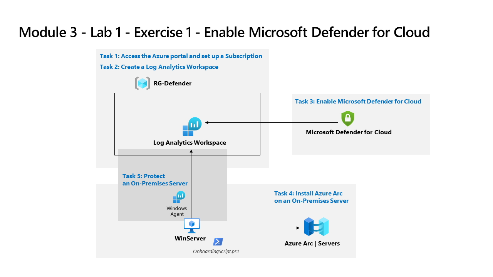

---
lab:
  title: "Exercice\_1\_: activer Microsoft\_Defender pour le cloud"
  module: Learning Path 3 - Mitigate threats using Microsoft Defender for Cloud
---

# Parcours d'apprentissage 3 - Labo 1 - Exercice 1 - Activer Microsoft Defender pour le cloud

## Scénario du labo

Vous êtes un analyste des opérations de sécurité travaillant dans une entreprise qui met en œuvre la protection des charges de travail cloud avec Microsoft Defender pour le cloud.  Dans ce labo, vous allez activer Microsoft Defender pour le cloud.

>**Remarque :** Une **[simulation de labo interactive](https://mslabs.cloudguides.com/guides/SC-200%20Lab%20Simulation%20-%20Enable%20Microsoft%20Defender%20for%20Cloud)** est disponible et vous permet de progresser à votre propre rythme. Il peut exister de légères différences entre la simulation interactive et le labo hébergé. Toutefois, les concepts et idées de base présentés sont identiques. 

### Tâche 1 : accéder au Portail Azure et configurer un abonnement

Dans cette tâche, vous allez configurer un abonnement Azure nécessaire pour terminer ce labo et les suivants.

1. Connectez-vous à la machine virtuelle **WIN1** en tant qu'Admin avec le mot de passe suivant : **Pa55w.rd**.  

1. Ouvrez le navigateur Microsoft Edge ou un nouvel onglet s’il est déjà ouvert.

1. Dans le navigateur Edge, accédez au Portail Azure à l’adresse https://portal.azure.com).

1. Dans la boîte de dialogue **Se connecter** , copiez et collez le compte de messagerie du locataire pour le nom d’utilisateur administrateur fourni par votre fournisseur d’hébergement de labo, puis sélectionnez **Suivant**.

1. Dans la boîte de dialogue **Entrer le mot de passe**, copiez et collez le mot de passe du locataire de l’administrateur fourni par votre fournisseur d’hébergement de labo, puis sélectionnez **Se connecter**.

1. Dans la barre de recherche du Portail Azure, tapez *Abonnement*, puis sélectionnez **Abonnements**. 

1. Sélectionnez l’abonnement *« Pass Azure - Parrainage »* affiché (ou nom équivalent dans la langue sélectionnée).

    >**Remarque :** si l’abonnement n’est pas affiché, demandez à votre instructeur comment créer l’abonnement Azure avec les informations d’identification d’utilisateur administrateur de locataire. **Remarque :** le processus de création d’abonnement peut prendre jusqu’à 10 minutes. 

1. Sélectionnez **Contrôle d’accès (IAM)**, puis **Ajouter une attribution de rôle** dans la zone *Accorder l’accès à cette ressource*.

1. Sélectionnez l’onglet **Rôles d’administrateur privilégié**, puis **Propriétaire**. Sélectionnez **Suivant** pour continuer.

1. Sous l’onglet *Membres*, sélectionnez **+ Sélectionner des membres**, puis sélectionnez le compte **Administrateur MOD**, puis **Sélectionner** pour continuer.

    >**Remarque :** si vous voyez l’onglet **Conditions** (avec un point rouge), sélectionnez **Suivant**, puis **Non contraint** à partir du type *Délégation.

1. Sélectionnez **Vérifier + attribuer** deux fois pour attribuer le rôle de propriétaire à votre compte Administrateur.

>**Important :** ces labos ont été conçus pour utiliser moins de 10 USD de services Azure pendant la classe.

### Tâche 2 : créer un espace de travail Log Analytics

Dans cette tâche, vous allez créer un espace de travail Log Analytics à utiliser avec Microsoft Defender pour le cloud.

1. Dans la barre de recherche du Portail Azure, tapez *Espaces de travail Log Analytics*, puis sélectionnez le même nom de service.

1. Sélectionnez **+ Créer** dans la barre de commandes.

1. Sélectionnez **Créer** pour le groupe de ressources.

1. Entrez *RG-Defender*, puis sélectionnez **OK**.

1. Pour le nom, entrez quelque chose d’unique comme : *uniquenameDefender*.

1. Sélectionnez **Vérifier + créer**.

1. Une fois la validation de l’espace de travail réussie, sélectionnez **Créer**. Patientez quelques minutes pendant la configuration du nouvel espace de travail.

### Tâche 3 : activer Microsoft Defender pour le cloud

Dans cette tâche, vous allez activer et configurer Microsoft Defender pour le cloud.

1. Dans la barre de recherche du Portail Azure, tapez *Defender*, puis sélectionnez **Microsoft Defender pour le cloud**.

1. Dans la page **Mise en route**, sous l’onglet **Mise à niveau**, vérifiez que votre abonnement est sélectionné, puis sélectionnez le bouton **Mettre à niveau** en bas de la page. Attendez que la notification du *lancement de l’essai* apparaisse, cela prend environ 2 minutes. 

    >**Conseil :** vous pouvez cliquer sur le bouton en forme de cloche dans la barre supérieure pour passer en revue vos notifications de Portail Azure.

    >**Remarque :** si vous voyez l’erreur *« Impossible de démarrer l’essai d’Azure Defender sur l’abonnement »,* passez aux étapes suivantes pour activer tous les plans Defender à l’étape 5.

1. Dans le menu de gauche de Microsoft Defender pour le cloud, sous Gestion, sélectionnez **Paramètres de l’environnement**.

1. Sélectionnez l’abonnement **« Pass Azure - Parrainage »** (ou nom équivalent dans votre langue). 

1. Passez en revue les ressources Azure qui sont désormais protégées avec les plans de Defender pour le cloud.

    >**Important :** si tous les plans Defender sont désactivés**, sélectionnez **Activer tous les plans**, puis cliquez sur **Enregistrer**. Attendez que la notification *« Plan de ressources dans l’abonnement Pass Azure enregistré avec succès ! »* s’affiche.

1. Dans la zone Paramètres (en regard d’Enregistrer), sélectionnez l’onglet **Paramètres et surveillance**.

1. Passez en revue les extensions de surveillance. Elles comprennent des configurations pour les machines virtuelles, les conteneurs et les comptes de stockage. Fermez la page « Paramètres et surveillance » en cliquant sur le bouton X dans le coin supérieur droit de la page.

1. Fermez la page des paramètres en cliquant sur le bouton X, dans le coin supérieur droit de la page, pour revenir aux **Paramètres d’environnement**, puis sélectionnez l’icône « > » à gauche de votre abonnement.

1. Sélectionnez l’espace de travail Log Analytics *nomuniqueDefender* que vous avez créé précédemment et passez en revue les options disponibles et la tarification.

1. Sélectionnez **Activer tous les plans** (en regard de l’élément Sélectionner le plan Defender), puis cliquez sur **Enregistrer**. Attendez que la notification *« Le plan Microsoft Defender pour l’espace de travail nomuniqueDefender a été enregistré avec succès ! »* s’affiche.

    >**Remarque :** si la page ne s’affiche pas, actualisez votre navigateur Edge et réessayez.

1. Fermez la page des plans Defender en sélectionnant le bouton « X » en haut à droite de la page pour revenir aux **Paramètres de l’environnement**

### Tâche 4 : installer Azure Arc sur un serveur local

Dans cette tâche, vous allez installer Azure Arc sur un serveur local pour faciliter l’intégration.

>**Important :** les étapes suivantes sont effectuées sur une machine différente de celle que vous utilisiez précédemment. Recherchez les références de nom de machine virtuelle.

1. Connectez-vous à la machine virtuelle **WINServer** en tant qu'Administrateur avec le mot de passe suivant : **Passw0rd!** (le cas échéant).  

1. Ouvrez le navigateur Microsoft Edge et accédez au Portail Azure à l’adresse https://portal.azure.com.

1. Dans la boîte de dialogue **Connexion**, copiez et collez le compte de **messagerie du locataire** fourni par l’hébergeur du labo, puis sélectionnez **Suivant**.

1. Dans la boîte de dialogue **Entrer un mot de passe**, copiez et collez le **mot de passe du locataire** fourni par l’hébergeur du labo, puis sélectionnez **Connexion**.

1. Dans la barre de recherche du Portail Azure, tapez *Arc*, puis sélectionnez **Azure Arc**.

1. Dans le volet de navigation, sous **Infrastructure**, sélectionnez **Machines**.

1. Sélectionnez **+ Ajouter/Créer**, puis **Ajouter une machine**.

1. Dans la section « Ajouter un serveur unique », sélectionnez **Générer un script**.

1. Lisez l’onglet *Conditions préalables*, puis sélectionnez **Suivant** pour continuer.

1. Dans la page *Ajouter un serveur avec Azure Arc* , sélectionnez le groupe de ressources que vous avez créé précédemment sous *Détails du projet*. **Conseil :***RG-Defender*

    >**Remarque :** si vous n’avez pas encore créé de groupe de ressources, ouvrez un autre onglet, créez le groupe de ressources et recommencez.

1. Pour la *Région*, sélectionnez **USA Est** dans la liste déroulante.

1. Passez en revue les *Détails du serveur* et les options de la *méthode de connectivité*. Conservez les valeurs par défaut et sélectionnez **Suivant** pour accéder à l’onglet Balises.

1. Passez en revue les balises disponibles par défaut. Sélectionnez **Suivant** pour accéder à l’onglet Télécharger et exécuter le script.

1. Faites défiler la page et sélectionnez le bouton **Télécharger**. **Conseil :** si votre navigateur bloque le téléchargement, prenez des mesures dans le navigateur pour l’autoriser. Dans le navigateur Edge, sélectionnez le bouton de points de suspension (...) si nécessaire, puis sélectionnez **Conserver**.

1. Cliquez avec le bouton droit sur Démarrer Windows et sélectionnez **Windows PowerShell (admin)**.

1. Entrez *Administrator* pour le nom d’utilisateur et *Passw0rd!*. pour le « Mot de passe » si une invite UAC apparaît.

1. Entrez : cd C:\Users\Administrator\Downloads

    >**Important :** si ce répertoire n’existe pas, cela signifie probablement que vous n’êtes pas le bon ordinateur. Revenez au début de la tâche 4 et connectez-vous à nouveau à la machine virtuelle WINServer.

1. Tapez *Set-ExecutionPolicy -ExecutionPolicy Unrestricted* et appuyez sur Entrée.

1. Entrez **A** pour Oui pour tout, puis appuyez sur Entrée.

1. Tapez *.\OnboardingScript.ps1* et appuyez sur Entrée.  

    >**Important :** si vous obtenez l’erreur *« Le terme .\OnboardingScript.ps1 n’est pas reconnu... »*, vérifiez que vous effectuez les étapes de la tâche 4 dans la machine virtuelle WINServer. Il se peut également que le nom du fichier ait changé à la suite de plusieurs téléchargements. Recherchez *« .\OnboardingScript (1).ps1 »* ou d’autres numéros de fichier dans le répertoire actif.

1. Entrez **R** pour exécuter une seule fois et appuyez sur Entrée (cela peut prendre quelques minutes).

1. Le processus d’installation ouvre un nouvel onglet dans le navigateur Edge pour authentifier l’agent Azure Arc. Sélectionnez votre compte d’administrateur, attendez que le message « Authentification terminée » s’affiche, puis revenez à la fenêtre Windows PowerShell.

1. Une fois l’installation terminée, revenez à la page Portail Azure où vous avez téléchargé le script, puis sélectionnez **Fermer**. Fermez **Ajouter des serveurs avec Azure Arc** pour revenir à la page **Machines** Azure Arc.

1. Sélectionnez **Actualiser** jusqu’à ce que le nom du serveur WINServer s’affiche et que l’état soit *Connecté*.

    >**Remarque** : cela peut prendre quelques minutes.

### Tâche 5 : protéger un serveur local

Dans cette tâche, vous allez installer manuellement l’*agent Azure Monitor* en ajoutant une *règle de collecte de données (DCR)* sur la machine virtuelle **WINServer**.

1. Accédez à **Microsoft Defender pour le cloud** et sélectionnez la page **Prise en main** dans le menu de gauche.

1. Sélectionnez l’onglet **Démarrer**.

1. Faites défiler vers le bas et sélectionnez **Configurer** sous la section *Ajouter des serveurs non-Azure*.

1. Sélectionnez **Mettre à niveau** à côté de l’espace de travail que vous avez créé précédemment. Cela peut prendre quelques minutes, attendez de voir la notification *« Le plan Microsoft Defender pour l’espace de travail uniquenameDefender a été enregistré avec succès ! ».*

1. Sélectionnez **+ Ajouter des serveurs** en regard de l’espace de travail que vous avez créé précédemment.

1. Sélectionner **Règles de collecte de données**

1. Sélectionnez **+ Créer**.

1. Entrez **WINServer** pour le nom de la règle.

1. Sélectionnez votre abonnement *« Pass Azure - Parrainage »* et sélectionnez un groupe de ressources. **Conseil :***RG-Defender*

1. Vous pouvez conserver la région *USA Est* par défaut ou sélectionner un autre emplacement préférable.

1. Sélectionnez la case d’option **Windows** pour *Type de plateforme*, puis sélectionnez **Suivant : Ressources**.

1. Sous l’onglet **Ressources**, sélectionnez **+ Ajouter des ressources**.

1. Dans la page **Sélectionner une étendue**, développez la colonne *Étendue* pour **RG-Defender** (ou le groupe de ressources que vous avez créé), puis sélectionnez **WINServer**, et **Appliquer**.

    >**Remarque :** vous devrez peut-être définir le filtre de colonne pour *Type de ressource* sur *Server-Azure Arc* si **WINServer** n’est pas affiché.

1. Sélectionnez **Suivant : Collecter et livrer**.

1. Sous l’onglet **Collecter et livrer**, sélectionnez **+ Ajouter une source de données**.

1. Dans la page **Ajouter une source de données**, sélectionnez **Compteurs de performances** depuis *Type de source de données*.

    >**Remarque :** pour les besoins de ce labo, vous pouvez sélectionner *Journaux des événements Windows*. Ces sélections peuvent être révisées ultérieurement.

1. Sélectionnez **Ajouter une source de données** et **Vérifier + créer**

1. Sélectionnez **Créer** une fois que *Validation réussie* s’affiche.

1. La création de la **Règle de collecte de données** lance l’installation de l’extension *AzureMonitorWindowsAgent* sur **WINServer**.

1. Une fois la création de la *Règle de collecte de données* terminée, entrez **WINServer** dans la barre de recherche *Rechercher des ressources des services et des documents*, puis sélectionnez **WINServer** à partir de *Ressources*.

1. Dans **WINServer**, faites défiler le menu de gauche jusqu’à *Paramètres* et *Extensions*.

1. **AzureMonitorWindowsAgent ** doit être répertorié avec un *état* **Réussi**.

1. Vous pouvez passer au labo suivant et revenir ultérieurement pour passer en revue la section **Inventaire** de **Microsoft Defender pour le cloud** pour vérifier que **WINServer** est inclus.

## Passez à l’exercice 2
