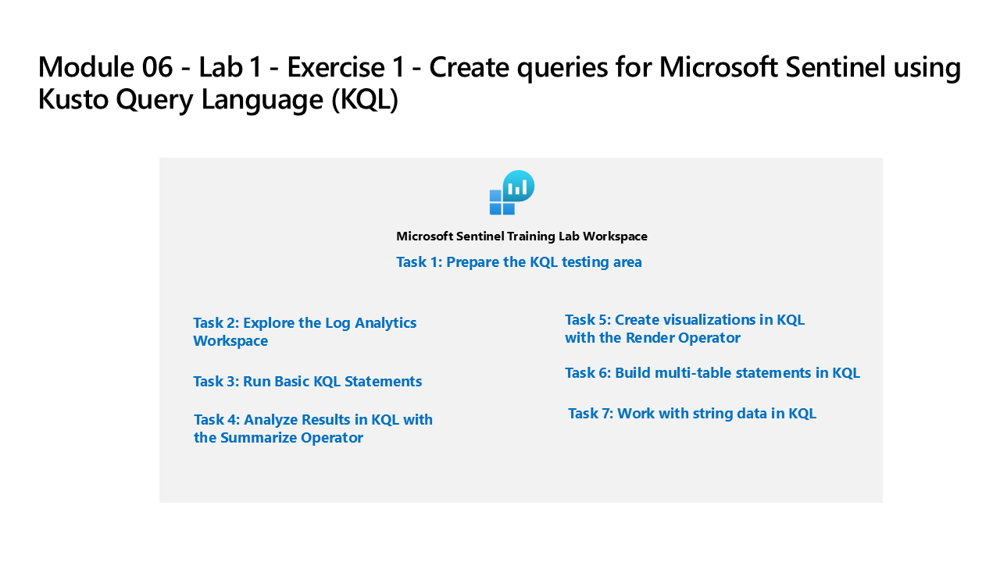

---
lab:
  title: "Exercice\_1\_: créer des requêtes pour Microsoft\_Sentinel avec le langage de requête Kusto (KQL)"
  module: Learning Path 6 - Create queries for Microsoft Sentinel using Kusto Query Language (KQL)
---

# Parcours d’apprentissage 6 - Labo 1- Exercice 1 - Créer des requêtes pour Microsoft Sentinel avec le langage de requête Kusto (KQL)

## Scénario du labo



Vous êtes un analyste des opérations de sécurité travaillant dans une entreprise qui implémente Microsoft Azure Sentinel. Vous êtes chargé d’effectuer une analyse des données de journal pour rechercher des activités malveillantes, afficher des visualisations et effectuer des recherches de menaces. Pour interroger les données du journal, vous utilisez le langage de requête Kusto (KQL).

>**Important :** ce labo implique d’entrer de nombreux scripts KQL dans Microsoft Sentinel. Les scripts ont été fournis dans un fichier au début de ce labo. Vous pouvez également les télécharger ici : <https://github.com/MicrosoftLearning/SC-200T00A-Microsoft-Security-Operations-Analyst/tree/master/Allfiles>

### Temps estimé pour terminer ce labo : 60 minutes

### Tâche 1 : accéder à la zone de test KQL

Dans cette tâche, vous allez accéder à un environnement Log Analytics dans lequel vous pouvez vous entraîner à écrire des instructions KQL.

1. Connectez-vous à la machine virtuelle **WIN1** en tant qu’administrateur ou administratrice avec le mot de passe : **Pa55w.rd**.  

1. Dans le navigateur Microsoft Edge, accédez à <https://aka.ms/lademo> et connectez-vous avec les informations d’identification d’administrateur.

1. Fermez la fenêtre contextuelle de la vidéo Log Analytics qui s’affiche.

1. Explorez les tables disponibles et les autres outils dans le volet *Schéma et filtre* situé sur le côté gauche de l’écran.

1. Dans l’éditeur de requête, entrez la requête suivante, puis sélectionnez le bouton **Exécuter**. Vous devez voir les résultats de la requête dans la fenêtre inférieure.

    ```KQL
    SecurityEvent
    ```

1. Notez que vous avez atteint le nombre maximal de résultats (30 000).

1. Changez l’**intervalle de temps* et définissez-le sur *30 dernières minutes** dans la fenêtre de requête.

1. En regard du premier enregistrement, sélectionnez le bouton **>** pour développer les informations de la ligne.


### Tâche 2 : exécuter des instructions KQL simples

Dans cette tâche, vous allez créer des instructions KQL simples.

>**Important :** pour chaque requête, effacez l’instruction précédente de la fenêtre de requête ou ouvrez une nouvelle fenêtre de requête en sélectionnant **+** après le dernier onglet ouvert (jusqu’à 25).

1. L’instruction suivante illustre l’opérateur **Search**, qui recherche la valeur dans toutes les colonnes de la table.

1. Changez l’**intervalle de temps* et définissez-le sur *30 dernières minutes** dans la fenêtre de requête.

1. Dans la fenêtre de requête, entrez l’instruction suivante, puis sélectionnez **Exécuter** :

    ```KQL
    search "location"
    ```

    >**Remarque :** L’utilisation de l’opérateur *Search* sans tables spécifiques ou clauses éligibles est moins efficace que le filtrage de texte spécifique à une table ou à une colonne.

1. L’instruction suivante illustre l’opérateur **search** dans les tables répertoriées dans la clause **In**. Dans la fenêtre de requête, entrez l’instruction suivante, puis sélectionnez **Exécuter** : 

    ```KQL
    search in (SecurityEvent,App*) "new"
    ```

1. Changez l’*intervalle de temps* et définissez-le sur **Dernières 24 heures** dans la fenêtre de requête.

1. Les instructions suivantes illustrent l’opérateur **Where**, qui filtre selon un prédicat spécifique. Dans la fenêtre de requête, entrez l’instruction suivante, puis sélectionnez **Exécuter** : 

    >**Important :** vous devez sélectionner **Exécuter** après avoir entré chaque requête des blocs de code ci-dessous.

    ```KQL
    SecurityEvent  
    | where TimeGenerated > ago(1h)
    ```

    >**Remarque :** l’*intervalle de temps* affiche désormais *Défini dans la requête*, car nous filtrons avec la colonne TimeGenerated.

    ```KQL
    SecurityEvent  
    | where TimeGenerated > ago(1h) and EventID == 4624
    ```

    ```KQL
    SecurityEvent  
    | where TimeGenerated > ago(1h)
    | where EventID == 4624  
    | where AccountType =~ "user"
    ```

    ```KQL
    SecurityEvent  
    | where TimeGenerated > ago(1h) and EventID in (4624, 4625)
 
    ```

1. L’instruction suivante illustre l’utilisation de l’instruction **Let** pour déclarer des *variables*. Dans la fenêtre de requête, entrez l’instruction suivante, puis sélectionnez **Exécuter** : 

    ```KQL
    let timeOffset = 1h;
    let discardEventId = 4688;
    SecurityEvent
    | where TimeGenerated > ago(timeOffset*2) and TimeGenerated < ago(timeOffset)
    | where EventID != discardEventId
    ```

1. L’instruction suivante illustre l’utilisation de l’instruction **Let** pour déclarer une *liste dynamique*. Dans la fenêtre de requête, entrez l’instruction suivante, puis sélectionnez **Exécuter** : 

    ```KQL
    let suspiciousAccounts = datatable(account: string) [
      @"NA\timadmin", 
      @"NT AUTHORITY\SYSTEM"
    ];
    SecurityEvent  
    | where TimeGenerated > ago(1h)
    | where Account in (suspiciousAccounts)
    ```

    >**Conseil :** vous pouvez facilement mettre en forme la requête en sélectionnant les points de suspension (…) dans la fenêtre de requête et en sélectionnant **Mettre en forme la requête**.

1. L’instruction suivante illustre l’utilisation de l’instruction **Let** pour déclarer une *table dynamique*. Dans la fenêtre de requête, entrez l’instruction suivante, puis sélectionnez **Exécuter** : 

    ```KQL
    let LowActivityAccounts =
        SecurityEvent 
        | summarize cnt = count() by Account 
        | where cnt < 1000;
    LowActivityAccounts | where Account contains "sql"
    ```

1. Changez l’**intervalle de temps** et définissez-le sur **Dernière heure** dans la fenêtre de requête. Cela limite nos résultats pour les instructions suivantes.

1. L’instruction suivante illustre l’opérateur **Extend**, qui crée une colonne calculée et l’ajoute au jeu de résultats. Dans la fenêtre de requête, entrez l’instruction suivante, puis sélectionnez **Exécuter** : 

    ```KQL
    SecurityEvent  
    | where TimeGenerated > ago(1h) 
    | where ProcessName != "" and Process != "" 
    | extend StartDir =  substring(ProcessName,0, string_size(ProcessName)-string_size(Process))
    ```

1. L’instruction suivante illustre l’opérateur **Order By**, qui trie les lignes de la table d’entrée par une ou plusieurs colonnes dans l’ordre croissant ou décroissant. L’opérateur **Order By** est un alias pour l’opérateur **Sort By**. Dans la fenêtre de requête, entrez l’instruction suivante, puis sélectionnez **Exécuter** : 

    ```KQL
    SecurityEvent  
    | where TimeGenerated > ago(1h) 
    | where ProcessName != "" and Process != "" 
    | extend StartDir =  substring(ProcessName,0, string_size(ProcessName)-string_size(Process)) 
    | order by StartDir desc, Process asc
    ```

1. Les instructions suivantes illustrent l’opérateur de **projet**, qui permet de sélectionner les colonnes à inclure dans l’ordre spécifié. Dans la fenêtre de requête, entrez l’instruction suivante, puis sélectionnez **Exécuter** : 

    ```KQL
    SecurityEvent  
    | where TimeGenerated > ago(1h) 
    | where ProcessName != "" and Process != "" 
    | extend StartDir =  substring(ProcessName,0, string_size(ProcessName)-string_size(Process)) 
    | order by StartDir desc, Process asc 
    | project Process, StartDir
    ```

1. Les instructions suivantes illustrent l’opérateur **hors-projet**, qui permet de sélectionner les colonnes à exclure de la sortie. Dans la fenêtre de requête, entrez l’instruction suivante, puis sélectionnez **Exécuter** : 

    ```KQL
    SecurityEvent  
    | where TimeGenerated > ago(1h) 
    | where ProcessName != "" and Process != "" 
    | extend StartDir =  substring(ProcessName,0, string_size(ProcessName)-string_size(Process)) 
    | order by StartDir desc, Process asc 
    | project-away ProcessName
    ```

### Tâche 3 : analyser les résultats dans KQL avec l’opérateur de synthèse

Dans cette tâche, vous allez générer des instructions KQL pour agréger des données. L’opérateur de **Synthèse** regroupe les lignes en fonction du **regroupement** de colonnes et calcule les agrégations sur chaque groupe

1. L’instruction suivante illustre la fonction **count()**, qui renvoie le compte du groupe. Dans la fenêtre de requête, entrez l’instruction suivante, puis sélectionnez **Exécuter** : 

    ```KQL
    SecurityEvent  
    | where TimeGenerated > ago(1h) and EventID == 4688  
    | summarize count() by Process, Computer
    ```

1. L’instruction suivante illustre la fonction **count()**, mais dans cet exemple, nous allons nommer la colonne *cnt*. Dans la fenêtre de requête, entrez l’instruction suivante, puis sélectionnez **Exécuter** : 

    ```KQL
    SecurityEvent  
    | where TimeGenerated > ago(1h) and EventID == 4624  
    | summarize cnt=count() by AccountType, Computer
    ```

1. L’instruction suivante illustre la fonction **dcount()**, qui renvoie le compte distinct approximatif des éléments de groupe. Dans la fenêtre de requête, entrez l’instruction suivante, puis sélectionnez **Exécuter** : 

    ```KQL
    SecurityEvent  
    | where TimeGenerated > ago(1h)
    | summarize dcount(IpAddress)
    ```

1. L’instruction suivante est une règle permettant de détecter les échecs pour cause de mot de passe non valide sur plusieurs applications pour le même compte. Dans la fenêtre de requête, entrez l’instruction suivante, puis sélectionnez **Exécuter** : 

    ```KQL
    let timeframe = 30d;
    let threshold = 1;
    SigninLogs
    | where TimeGenerated >= ago(timeframe)
    | where ResultDescription has "Invalid password"
    | summarize applicationCount = dcount(AppDisplayName) by UserPrincipalName, IPAddress
    | where applicationCount >= threshold
    ```

1. L’instruction suivante illustre la fonction **arg_max()**, qui renvoie une ou plusieurs expressions lorsque l’argument est maximisé. L’instruction suivante renvoie la ligne la plus récente de la table SecurityEvent pour l’ordinateur SQL10.NA.contosohotels.com. Le * dans la fonction arg_max demande toutes les colonnes de la ligne. Dans la fenêtre de requête, entrez l’instruction suivante, puis sélectionnez **Exécuter** : 

    ```KQL
    SecurityEvent  
    | where Computer == "SQL10.na.contosohotels.com"
    | summarize arg_max(TimeGenerated,*) by Computer
    ```

1. L’instruction suivante illustre la fonction **arg_min()**, qui renvoie une ou plusieurs expressions lorsque l’argument est minimisé. Dans cette instruction, le plus ancien SecurityEvent pour l’ordinateur SQL10.NA.contosohotels.com est retourné en tant que jeu de résultats. Dans la fenêtre de requête, entrez l’instruction suivante, puis sélectionnez **Exécuter** : 

    ```KQL
    SecurityEvent  
    | where Computer == "SQL10.na.contosohotels.com"
    | summarize arg_min(TimeGenerated,*) by Computer
    ```

1. Les instructions suivantes illustrent l’importance de comprendre les résultats en fonction de l’ordre du *canal*. Dans la fenêtre Requête, entrez les requêtes suivantes et exécutez-les individuellement : 

    1. La **Requête 1** aura des Comptes pour lesquels la dernière activité était une connexion. La table SecurityEvent sera d’abord résumée et renverra la ligne la plus récente pour chaque Compte. Seules les lignes avec l’ID d’événement égal à 4624 (connexion) sont retournées.

        ```KQL
        SecurityEvent  
        | summarize arg_max(TimeGenerated, *) by Account 
        | where EventID == 4624  
        ```

    1. La **Requête 2** aura la connexion la plus récente pour les comptes qui se sont connectés. La table SecurityEvent sera filtrée pour inclure uniquement EventID = 4624. Ces résultats sont résumés pour la ligne de connexion la plus récente par compte.

        ```KQL
        SecurityEvent  
        | where EventID == 4624  
        | summarize arg_max(TimeGenerated, *) by Account
        ```

    >**Remarque :**  vous pouvez également consulter le « Total UC » et les « Données utilisées pour la requête traitée » en sélectionnant le lien « Détails de la requête », situé en bas à droite et comparer les données entre les deux instructions.

1. L’instruction suivante illustre la fonction **make_list()**, qui renvoie une *liste* de toutes les valeurs dans le groupe. Cette requête KQL filtre d’abord le EventID avec l’opérateur Where. Ensuite, pour chaque ordinateur, les résultats sont un tableau de comptes JSON. Le tableau JSON résultant inclura des comptes dupliqués. Dans la fenêtre de requête, entrez l’instruction suivante, puis sélectionnez **Exécuter** : 

    ```KQL
    SecurityEvent  
    | where TimeGenerated > ago(1h)
    | where EventID == 4624  
    | summarize make_list(Account) by Computer
    ```

1. L’instruction suivante illustre la fonction **make_set()**, qui renvoie un jeu de valeurs *distinctes* dans le groupe. Cette requête KQL filtre d’abord le EventID avec l’opérateur Where. Ensuite, pour chaque ordinateur, les résultats sont un tableau de comptes JSON. Dans la fenêtre de requête, entrez l’instruction suivante, puis sélectionnez **Exécuter** : 

    ```KQL
    SecurityEvent  
    | where TimeGenerated > ago(1h)
    | where EventID == 4624  
    | summarize make_set(Account) by Computer
    ```


### Tâche 4 : créer des visualisations dans KQL avec l’opérateur de rendu

Dans cette tâche, vous allez créer des visualisations à l’aide d’instructions KQL.

1. L’instruction suivante illustre l’opérateur de **rendu** (qui affiche les résultats sous forme de graphique), avec une visualisation sous forme de **graphique à barres**. Dans la fenêtre de requête, entrez l’instruction suivante, puis sélectionnez **Exécuter** : 

    ```KQL
    SecurityEvent  
    | where TimeGenerated > ago(1h)
    | summarize count() by Account
    | render barchart
    ```

1. L’instruction suivante illustre l’opérateur de **rendu**, qui permet d’afficher les résultats dans une série chronologique. La fonction **bin()** arrondit toutes les valeurs d’une période et les regroupe. Elle est souvent associée à l’opérateur de **synthèse**. Si vous avez un ensemble de valeurs éparses, les valeurs sont regroupées en un ensemble plus petit de valeurs spécifiques. En combinant les résultats générés et en les redirigeant vers un opérateur de **rendu** de type **graphique temporel**, nous obtenons une visualisation de série chronologique. Dans la fenêtre de requête, entrez l’instruction suivante, puis sélectionnez **Exécuter** : 

    ```KQL
    SecurityEvent  
    | where TimeGenerated > ago(1h)
    | summarize count() by bin(TimeGenerated, 1m)
    | render timechart
    ```


### Tâche 5 : générer des instructions de tables multiples à l’aide de KQL

Dans cette tâche, vous allez générer des instructions KQL à plusieurs tables.

1. Changez l’**intervalle de temps** et définissez-le sur **Dernière heure** dans la fenêtre de requête. Cela limite nos résultats pour les instructions suivantes.

1. L’instruction suivante illustre l’opérateur **Union**, qui prend deux tables ou plus et retourne toutes leurs lignes. Il est essentiel de comprendre comment les résultats sont passés et affectés par le caractère de barre verticale. Dans la fenêtre de requête, entrez les instructions suivantes et sélectionnez **Exécuter** pour chaque requête séparément afin d’afficher les résultats : 

    1. La **requête 1** retourne toutes les lignes de SecurityEvent et toutes les lignes de SigninLogs.

        ```KQL
        SecurityEvent  
        | union SigninLogs  
        ```

    1. La **requête 2** retourne une ligne et une colonne, qui correspond au nombre de toutes les lignes de SigninLogs et de toutes les lignes de SecurityEvent.

        ```KQL
        SecurityEvent  
        | union SigninLogs  
        | summarize count() 
        ```

    1. La **requête 3** retourne toutes les lignes de SecurityEvent et une (dernière) ligne de SigninLogs. La dernière ligne de SigninLogs aura le compte récapitulatif du nombre total de lignes.

        ```KQL
        SecurityEvent  
        | union (SigninLogs | summarize count() | project count_)
        ```

    >**Remarque :** la « ligne vide » dans les résultats affiche le compte récapitulatif de SigninLogs.

1. L’instruction suivante illustre la prise en charge de l’opérateur **Union** pour l’union de plusieurs tables avec des caractères génériques. Dans la fenêtre de requête, entrez l’instruction suivante, puis sélectionnez **Exécuter** : 

    ```KQL
    union App*  
    | summarize count() by Type
    ```

1. L’instruction suivant illustre l’opérateur **Join**, qui fusionne les lignes de deux tables pour en former une nouvelle en mettant en correspondance les valeurs des colonnes spécifiées de chaque table. Dans la fenêtre de requête, entrez l’instruction suivante, puis sélectionnez **Exécuter** : 

    ```KQL
    SecurityEvent  
    | where EventID == 4624 
    | summarize LogOnCount=count() by  EventID, Account
    | project LogOnCount, Account
    | join kind = inner( 
     SecurityEvent  
    | where EventID == 4634 
    | summarize LogOffCount=count() by  EventID, Account
    | project LogOffCount, Account
    ) on Account
    ```

    >**Important** : la première table spécifiée dans la jointure est considérée comme la table de gauche. La table après l’opérateur **Join** est la table de droite. Lorsque vous utilisez des colonnes de tables, le nom $left.Column et le nom $right.Column permettent de distinguer les colonnes auxquelles les tables font référence. L’opérateur **Join** prend en charge une gamme complète de types : flouter, inner, innerunique, leftanti, leftantisemi, leftouter, leftsemi, rightanti, rightantisemi, rightouter, rightsemi.

1. Changez l’**intervalle de temps** et définissez-le sur **Dernières 24 heures** dans la fenêtre de requête.

### Tâche 6 : utiliser des données de chaîne dans KQL

Dans cette tâche, vous allez utiliser des champs de chaîne structurés et non structurés avec des instructions KQL.

1. L’instruction suivante illustre la fonction **Extract**, qui obtient une correspondance pour une expression régulière à partir d’une chaîne source. Vous avez la possibilité de convertir la sous-chaîne extraite en type indiqué. Dans la fenêtre de requête, entrez l’instruction suivante, puis sélectionnez **Exécuter** : 

    ```KQL
    print extract("x=([0-9.]+)", 1, "hello x=45.6|wo") == "45.6"
    ```

1. L’instruction suivante utilise la fonction **Extract** pour extraire le nom du compte du champ « Account » de la table « SecurityEvent ». Dans la fenêtre de requête, entrez l’instruction suivante, puis sélectionnez **Exécuter** : 

    ```KQL
    SecurityEvent  
    | where EventID == 4672 and AccountType == 'User' 
    | extend Account_Name = extract(@"^(.*\\)?([^@]*)(@.*)?$", 2, tolower(Account))
    | summarize LoginCount = count() by Account_Name
    | where Account_Name != "" 
    | where LoginCount < 10
    ```

1. L’instruction suivante illustre l’opérateur **Parse**, qui évalue une expression de chaîne et analyse sa valeur en une ou plusieurs colonnes calculées. À utiliser pour structurer des données non structurées. Dans la fenêtre de requête, entrez l’instruction suivante, puis sélectionnez **Exécuter** : 

    ```KQL
    let Traces = datatable(EventText:string)
    [
    "Event: NotifySliceRelease (resourceName=PipelineScheduler, totalSlices=27, sliceNumber=23, lockTime=02/17/2016 08:40:01, releaseTime=02/17/2016 08:40:01, previousLockTime=02/17/2016 08:39:01)",
    "Event: NotifySliceRelease (resourceName=PipelineScheduler, totalSlices=27, sliceNumber=15, lockTime=02/17/2016 08:40:00, releaseTime=02/17/2016 08:40:00, previousLockTime=02/17/2016 08:39:00)",
    "Event: NotifySliceRelease (resourceName=PipelineScheduler, totalSlices=27, sliceNumber=20, lockTime=02/17/2016 08:40:01, releaseTime=02/17/2016 08:40:01, previousLockTime=02/17/2016 08:39:01)",
    "Event: NotifySliceRelease (resourceName=PipelineScheduler, totalSlices=27, sliceNumber=22, lockTime=02/17/2016 08:41:01, releaseTime=02/17/2016 08:41:00, previousLockTime=02/17/2016 08:40:01)",
    "Event: NotifySliceRelease (resourceName=PipelineScheduler, totalSlices=27, sliceNumber=16, lockTime=02/17/2016 08:41:00, releaseTime=02/17/2016 08:41:00, previousLockTime=02/17/2016 08:40:00)"
    ];
    Traces   
    | parse EventText with * "resourceName=" resourceName ", totalSlices=" totalSlices:long * "sliceNumber=" sliceNumber:long * "lockTime=" lockTime ", releaseTime=" releaseTime:date "," * "previousLockTime=" previousLockTime:date ")" *  
    | project resourceName, totalSlices, sliceNumber, lockTime, releaseTime, previousLockTime
    ```

>**Important :** les requêtes suivantes ne produisent actuellement pas de résultats dans l’environnement lademo utilisé pour ce labo. Les entrées de la table *SigninLogs* ont été supprimées. Toutefois, les requêtes KQL présentent des concepts et des cas d’usage importants. Veuillez donc prendre le temps de les examiner.

1. L’instruction suivante illustre l’utilisation de champs **dynamiques**, qui sont spéciaux, car ils peuvent prendre n’importe quelle valeur d’autres types de données. Dans cet exemple, le champ DeviceDetail de la table SigninLogs est de type **dynamique**. Dans la fenêtre de requête, entrez l’instruction suivante, puis sélectionnez **Exécuter** : 

    ```KQL
    SigninLogs 
    | extend OS = DeviceDetail.operatingSystem
    ```

1. L’exemple suivant montre comment décomposer les champs remplis pour SigninLogs. Dans la fenêtre de requête, entrez l’instruction suivante, puis sélectionnez **Exécuter** :

    ```KQL
    SigninLogs 
    | extend OS = DeviceDetail.operatingSystem, Browser = DeviceDetail.browser 
    | extend StatusCode = tostring(Status.errorCode), StatusDetails = tostring(Status.additionalDetails) 
    | extend Date = startofday(TimeGenerated) 
    | summarize count() by Date, Identity, UserDisplayName, UserPrincipalName, IPAddress, ResultType, ResultDescription, StatusCode, StatusDetails 
    | sort by Date
    ```

    >**Important :** bien que le type dynamique apparaisse au format JSON, il peut contenir des valeurs qui ne sont pas représentées par le modèle JSON, car elles n’existent pas dans JSON. Par conséquent, lors de la sérialisation de valeurs dans une représentation JSON, les valeurs que JSON ne peut pas représenter sont sérialisées en valeurs de chaîne. 

1. Les instructions suivantes illustrent les opérateurs pour manipuler le JSON stocké dans des champs de chaîne. De nombreux journaux envoient des données au format JSON, ce qui vous oblige à savoir comment transformer des données JSON en champs pouvant être interrogés. Dans la fenêtre de requête, entrez l’instruction suivante, puis sélectionnez **Exécuter** : 

    ```KQL
    SigninLogs 
    | extend AuthDetails =  parse_json(AuthenticationDetails) 
    | extend AuthMethod =  AuthDetails[0].authenticationMethod 
    | extend AuthResult = AuthDetails[0].["authenticationStepResultDetail"] 
    | project AuthMethod, AuthResult, AuthDetails 
    ```

1. L’instruction suivante illustre l’opérateur **mv-expand**, qui transforme les tableaux dynamiques en lignes (expansion à valeurs multiples).

    ```KQL
    SigninLogs 
    | mv-expand AuthDetails = parse_json(AuthenticationDetails) 
    | project AuthDetails
    ```

1. Développez la première ligne en sélectionnant « > », puis à nouveau en regard d’*AuthDetails* pour passer en revue les résultats développés.

1. L’instruction suivante illustre l’opérateur **mv-apply**, qui applique une sous-requête à chaque enregistrement et retourne l’union des résultats de toutes les sous-requêtes.

    ```KQL
    SigninLogs 
    | mv-apply AuthDetails = parse_json(AuthenticationDetails) on
    (where AuthDetails.authenticationMethod == "Password")
    ```

1. Une **fonction** est une requête de journal qui peut être utilisée dans d’autres requêtes de journal avec le nom enregistré comme commande. Pour créer une **fonction**, après avoir exécuté votre requête, sélectionnez le bouton **Enregistrer**, puis **Enregistrer comme fonction** dans la liste déroulante. Entrez le nom de votre choix (par exemple : *PrivLogins*) dans la zone **Nom de la fonction**, puis entrez une **catégorie héritée** (par exemple : *Général*) et sélectionnez **Enregistrer**. La fonction sera disponible dans KQL à l’aide de l’alias de la fonction :

    >**Remarque :** vous ne pourrez pas le faire dans l’environnement lademo utilisé pour ce labo, car votre compte dispose uniquement des autorisations Lecteur, mais il est important d’améliorer l’efficacité de vos requêtes. 

    ```KQL
    PrivLogins  
    ```

## Vous avez terminé le labo.
