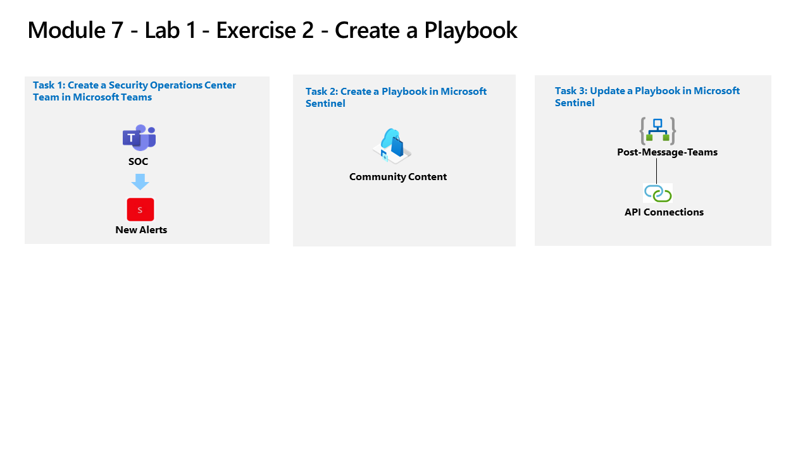

---
lab:
  title: "Exercice\_2 : créer un playbook"
  module: Learning Path 7 - Create detections and perform investigations using Microsoft Sentinel
---

# Parcours d’apprentissage 7 - Labo 1 - Exercice 2 : créer un playbook

## Scénario du labo

Vous êtes un analyste des opérations de sécurité travaillant dans une entreprise ayant mis en œuvre Microsoft Sentinel. Vous devez apprendre à détecter et à atténuer les menaces à l’aide de Microsoft Sentinel. À présent, vous souhaitez répondre et corriger des actions qui peuvent être exécutées à partir de Microsoft Sentinel en tant que routine.

Un playbook peut vous aider à automatiser et orchestrer votre réponse aux menaces. Il peut s’intégrer à d’autres systèmes, aussi bien internes qu’externes, et être configuré pour s’exécuter automatiquement en réponse à des alertes ou des incidents spécifiques, lorsqu’il est déclenché par une règle analytique ou une règle d’automatisation, respectivement. 

>**Remarque :** Une **[simulation de labo interactive](https://mslabs.cloudguides.com/guides/SC-200%20Lab%20Simulation%20-%20Create%20a%20playbook)** est disponible et vous permet de progresser à votre propre rythme. Il peut exister de légères différences entre la simulation interactive et le labo hébergé. Toutefois, les concepts et idées de base présentés sont identiques.

### Tâche 1 : créer une équipe de Centre des opérations de sécurité dans Microsoft Teams

Dans cette tâche, vous allez créer une équipe Microsoft Teams qui sera utilisée dans le labo.

1. Connectez-vous à la machine virtuelle WIN1 en tant qu’Administrateur ou Administratrice avec le mot de passe : **Pa55w.rd**.  

1. Dans le navigateur Microsoft Edge, ouvrez un nouvel onglet et accédez au portail Microsoft Teams à l’adresse https://teams.microsoft.com).

1. Dans la boîte de dialogue **Connexion**, copiez et collez le compte de **messagerie du locataire** fourni par l’hébergeur du labo, puis sélectionnez **Suivant**.

1. Dans la boîte de dialogue **Entrer un mot de passe**, copiez et collez le **mot de passe du locataire** fourni par l’hébergeur du labo, puis sélectionnez **Connexion**.

1. Fermez les fenêtres contextuelles Teams qui peuvent apparaître.

    >**Remarque :** Si vous êtes invité à utiliser **New Teams**, acceptez et poursuivez avec l’exercice.

1. Si ce n’est pas déjà le cas, sélectionnez **Teams** dans le menu de gauche, puis en haut, sélectionnez l’icône .

1. Sélectionnez l’option **Créer une équipe**.

1. Sélectionnez le bouton **À partir de zéro**.

1. Sélectionnez le bouton **Privé**.

1. Donnez un nom à l’équipe : tapez **SOC** et sélectionnez le bouton **Créer**.

1. Dans l’écran Ajouter des membres à SOC, sélectionnez le bouton **Ignorer**. 

1. Faites défiler le panneau Teams pour localiser l’équipe SOC nouvellement créée, sélectionnez les points de suspension **(…)** à droite du nom et sélectionnez **Ajouter un canal**.

1. Entrez le nom de canal *Nouvelles alertes*, puis sélectionnez le bouton **Ajouter**.

### Tâche 2 : créer un playbook dans Microsoft Sentinel

Dans cette tâche, vous allez créer une application logique utilisée comme playbook dans Microsoft Sentinel.

1. Dans le navigateur Microsoft Edge, accédez à [Microsoft Sentinel sur GitHub](https://github.com/Azure/Azure-Sentinel).

<!--- the Azure portal at https://portal.azure.com.

1. In the **Sign in** dialog box, copy and paste in the **Tenant Email** account provided by your lab hosting provider and then select **Next**.

1. In the **Enter password** dialog box, copy and paste in the **Tenant Password** provided by your lab hosting provider and then select **Sign in**.

1. In the Search bar of the Azure portal, type *Sentinel*, then select **Microsoft Sentinel**.

1. Select your Microsoft Sentinel Workspace you created earlier.

1. Select the **Community** page under the *Content management* area on the left side of the page.

1. On the right pane, select the **Onboard community content** link. This opens a new tab in the Microsoft Edge Browser for Microsoft Sentinel GitHub content. **Hint:** You might need to scroll right to see the link. Alternatively, follow this link instead: [Microsoft Sentinel on GitHub](https://github.com/Azure/Azure-Sentinel). --->

1. Faites défiler vers le bas et sélectionnez le dossier **Solutions**.

1. Sélectionnez ensuite le dossier **SentinelSOARessentials**, puis le dossier **Playbooks**.

1. Sélectionnez le dossier **Post-Message-Teams**.

1. Dans la zone readme.md, faites défiler jusqu’à la section *Déploiement rapide*, **Déployer avec un déclencheur d’incident (recommandé)** et sélectionnez le bouton **Déployer sur Azure**.  

1. Vérifiez que abonnement Azure est sélectionné.

1. Pour le groupe de ressources, sélectionnez **Créer**, entrez *RG-Playbooks* et sélectionnez **OK**.

1. Laissez **USA Est** comme valeur par défaut pour la *région*.

1. Renommez le *Nom du playbook* en « PostMessageTeams-OnIncident », puis sélectionnez **Vérifier + créer**.

1. À présent, sélectionnez **Créer**. 

    >**Remarque :** attendez que le déploiement se termine avant de passer à la tâche suivante.

### Tâche 3 : mettre à jour un playbook dans Microsoft Sentinel

Dans cette tâche, vous allez mettre à jour le nouveau playbook que vous avez créé avec les informations de connexion appropriées.

1. Dans la barre de recherche du portail Azure, tapez *Sentinel*, puis sélectionnez **Microsoft Sentinel**.

1. Sélectionnez votre espace de travail Microsoft Sentinel.

1. Sélectionnez **Automatisation** sous la zone *Configuration*, puis sélectionnez l’onglet **Playbooks actifs**.

1. Sélectionnez **Actualiser** dans la barre de commandes si vous ne voyez aucun playbook. Vous devez voir le playbook créé à l’étape précédente.

1. Sélectionnez le nom du playbook **PostMessageTeams**.

1. Dans la page Application logique pour *PostMessageTeams*, dans le menu de commandes, sélectionnez **Modifier**.

    >**Remarque :** il peut être nécessaire d’actualiser la page.

1. Sélectionnez le *premier* bloc, **incident Microsoft Sentinel**.

1. Sélectionnez le lien **Modifier la connexion**.

1. Sélectionnez **Ajouter** et sélectionnez **Se connecter**. Dans la nouvelle fenêtre, sélectionnez les informations d’identification d’administrateur de votre abonnement Azure lorsque vous y êtes invité. La dernière ligne du bloc doit maintenant indiquer « Connecté à your-admin-username ».

1. Sélectionnez maintenant le *deuxième* bloc, **Publier un message (V3)**.

1. Sous l’onglet Prameters, faites défiler vers le bas et sélectionnez **Modifier le lien de connexion**, puis sélectionnez **Ajouter un nouveau** et **Se connecter**. Choisissez vos informations d’identification d’administrateur Azure lorsque vous y êtes invité. L’onglet Prameters doit maintenant lire « Connecté à votre-admin-username ».

1. À la fin du champ *Team*, sélectionnez le **X** pour effacer le contenu. Le champ est remplacé par une liste déroulante avec une liste des équipes disponibles dans Microsoft Teams. Sélectionnez **SOC**.

1. Faites de même pour le champ *Canal*. À la fin du champ pour effacer le contenu, sélectionnez **X**. Le champ est remplacé par une liste déroulante avec une liste des canaux des équipes SOC. Sélectionnez **Nouvelles alertes**.

1. Sélectionnez **Enregistrer** sur la barre de commandes. L’application logique sera utilisée dans un prochain labo.

## Passez à l’exercice 3
