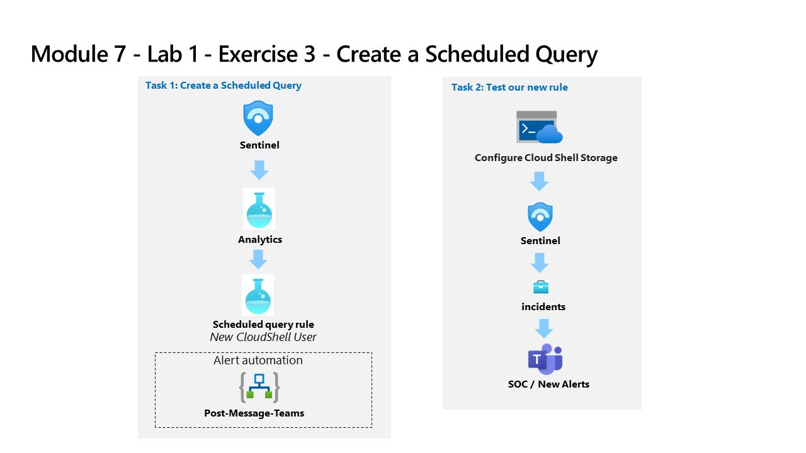

---
lab:
  title: "Exercice\_3\_: créer une requête planifiée à partir d’un modèle"
  module: Learning Path 7 - Create detections and perform investigations using Microsoft Sentinel
---

# Chemin d’apprentissage 7 - Labo 1 - Exercice 3 - Créer une requête planifiée à partir d’un modèle

## Scénario du labo

Vous êtes un analyste des opérations de sécurité travaillant dans une entreprise ayant mis en œuvre Microsoft Sentinel. Vous devez apprendre à détecter et à atténuer les menaces à l’aide de Microsoft Sentinel. Une fois que vous avez connecté vos sources de données à Microsoft Sentinel, créez des règles d’analyse personnalisées pour faciliter la détection des menaces et comportements anormaux au sein de votre environnement.

Les règles analytiques recherchent des événements ou des ensembles d'événements spécifiques au sein de votre environnement, vous préviennent lorsque certains seuils ou conditions d’événements sont atteints, génèrent des incidents que votre centre des opérations de sécurité (SOC) doit trier et examiner, et répondent aux menaces grâce à des processus de suivi et de correction automatisés.

>**Remarque :** Une **[simulation de labo interactive](https://mslabs.cloudguides.com/guides/SC-200%20Lab%20Simulation%20-%20Create%20a%20scheduled%20query)** est disponible et vous permet de progresser à votre propre rythme. Il peut exister de légères différences entre la simulation interactive et le labo hébergé. Toutefois, les concepts et idées de base présentés sont identiques. 

### Tâche 1 : créer une requête planifiée

Dans cette tâche, vous créez une requête planifiée et vous la connectez au canal Teams que vous avez créé au cours de l’exercice précédent.

1. Connectez-vous à la machine virtuelle WIN1 en tant qu’Administrateur ou Administratrice avec le mot de passe : **Pa55w.rd**.  

1. Dans la boîte de dialogue **Connexion**, copiez et collez le compte de **messagerie du locataire** fourni par l’hébergeur du labo, puis sélectionnez **Suivant**.

1. Dans la boîte de dialogue **Entrer un mot de passe**, copiez et collez le **mot de passe du locataire** fourni par l’hébergeur du labo, puis sélectionnez **Connexion**.

1. Dans la barre de recherche du portail Azure, tapez *Sentinel*, puis sélectionnez **Microsoft Sentinel**.

1. Sélectionnez votre espace de travail Microsoft Sentinel.

1. Dans la zone Configuration, sélectionnez **Analyses**.

1. Vérifiez que vous êtes dans l’onglet *Modèles de règle* dans la barre de commandes et recherchez la règle **Nouvel utilisateur CloudShell**.

1. Dans le panneau Résumé de la règle, vérifiez que vous recevez des données en examinant l’icône verte sous *Sources de données : activité Azure*.

    >**Remarque :** si vous ne le voyez pas dans un état connecté, assurez-vous que vous avez terminé la tâche 3 du laboratoire du chemin d’apprentissage 6, exercice 1.

1. Sélectionnez **Créer la règle** pour continuer.

1. Dans l’Assistant Règle d’analytique, sous l’onglet *Général*, définissez le niveau de *Gravité* sur **Moyen**.

1. Sélectionnez le bouton **Suivant : Définir la logique de règle >**  :

1. Pour la requête de règle, sélectionnez **Afficher les résultats de la requête**. Vous ne devriez plus recevoir de résultats ni d’erreurs.

1. Fermez la fenêtre *Journaux* en sélectionnant le bouton **X** en haut à droite, puis sélectionnez **OK** pour ignorer l’enregistrement des modifications et revenir à l’Assistant.

1. Faites défiler vers le bas et sous *Planification des requêtes*, spécifiez les paramètres suivants :

    |Paramètre|Valeur|
    |---|---|
    |Exécuter la requête toutes les|5 minutes|
    |Rechercher les données des dernières|1 jour|

    >**Remarque :** nous générons volontairement de nombreux incidents pour les mêmes données. Cela permet au labo d’utiliser ces alertes.

1. Dans la zone *Seuil d’alerte*, laissez la valeur inchangée, car nous voulons que l’alerte enregistre chaque événement.

1. Dans la zone *Regroupement d’événements*, laissez l’option **Regrouper tous les événements dans une seule alerte** sélectionnée, car nous voulons générer une alerte unique à chaque exécution, tant que la requête renvoie plus de résultats que le seuil d’alerte spécifié ci-dessus.

1. Sélectionnez le bouton **Suivant : Paramètres d’incident >**. 

1. Sous l’onglet *Paramètres d’incident*, passez en revue les options par défaut.

1. Sélectionnez le bouton **Suivant : Réponse automatisée >** 

1. Dans l’onglet *Réponse automatique*, sous *Règles d’automatisation*, sélectionnez **Ajouter**.

1. Pour le *Nom de la règle d’automatisation*, saisissez **Niveau 2**.

1. Pour les *Actions*, sélectionnez **Attribuer un propriétaire**.

1. Sélectionnez ensuite **Attribuer à moi-même**. Sélectionnez ensuite **+ Ajouter une action**.

1. Dans les menus déroulants *Et ensuite*, sélectionnez **Exécuter le playbook**

1. Un deuxième menu déroulant s’affiche avec un message *Informations (i)* concernant les autorisations du playbook et un **lien Gérer les autorisations du playbook**

    >**Remarque :** les playbooks apparaissent grisés dans la liste déroulante jusqu’à ce que les autorisations soient configurées.

1. Sélectionnez le lien **Gérer les autorisations du playbook** pour attribuer des autorisations.

1. Sur la page *Gérer les autorisations* , sélectionnez le groupe de ressources **RG Playbooks** que vous avez créé dans le labo précédent, puis sélectionnez **Appliquer**.

1. Dans le menu déroulant, sélectionnez le playbook **PostMessageTeams-OnIncident** que vous avez créé dans l’exercice précédent.

1. Sélectionnez **Appliquer**

1. Sélectionnez le bouton **Suivant : Vérifier et créer >**.
  
1. Sélectionnez **Enregistrer**.

### Tâche  2 : Tester votre nouvelle règle

Dans cette tâche, vous testez votre nouvelle règle de requête planifiée.

1. Dans la barre supérieure du Portail Azure, sélectionnez l’icône **>_** correspondant à Cloud Shell. Vous devrez peut-être d’abord sélectionenr l'icône représentant des points de suspension **(...)** si votre résolution d’affichage est trop faible.

1. Dans la fenêtre *Bienvenue dans Azure Cloud Shell*, sélectionnez **PowerShell**.

1. Sur la page *Prise en main*, sélectionnez **Monter le compte de stockage**, puis sélectionnez votre **Pass Azure - Sponsorship** à partir de l’élément de menu déroulant *Abonnement du compte de stockage* et sélectionnez le bouton **Appliquer**.

    >**Important :** Ne sélectionnez pas l'option de bouton radio *Aucun compte de stockage requis*. Cela entraîne l’échec de la création de l’incident.

1. Sur la page *Monter le compte de stockage*, sélectionnez **Nous allons créer un compte de stockage pour vous**, puis sélectionner **Suivant**.

1. Attendez que Cloud Shell soit provisionné, puis fermez la fenêtre Azure Cloud Shell.

1. Dans la barre de recherche du portail Azure, tapez *Activité*, puis sélectionnez **Journal d’activité**.

1. Vérifiez si les éléments *Nom de l’opération* s’affichent : **Répertorier les clés d’accès aux comptes de stockage**et  **Mettre à jour les comptes de stockage créés**. Il s’agit des opérations que la requête KQL que vous avez examinée précédemment mettra en correspondance pour générer l’alerte. **Conseil :** vous devrez peut-être sélectionner **Actualiser** pour mettre à jour la liste.

1. Dans la barre de recherche du portail Azure, tapez *Sentinel*, puis sélectionnez **Microsoft Sentinel**.

1. Sélectionnez votre espace de travail Microsoft Sentinel.

1. Sélectionnez l’option de menu **Incidents** sous *Gestion des  menaces*.

1. Sélectionnez le bouton bascule **Actualiser automatiquement les incidents**.

1. L’environnement venant d’être créé devrait s’afficher.

    >**Remarque :** l’événement qui déclenche l’incident peut prendre 5 minutes de plus. Continuez avec l’exercice suivant. Vous reviendrez à cette vue après.

1. Sélectionnez l’incident et passez en revue les informations dans le panneau droit.

1. Revenez à Microsoft Teams en sélectionnant l’onglet dans votre navigateur Microsoft Edge. Si vous l’avez fermé, ouvrez simplement un nouvel onglet et tapez https://teams.microsoft.com. Accédez à Teams  *SOC*, sélectionnez le canal *Nouvelles alertes*, puis onsultez le message publié concenrant l’incident.

## Passer à l’Exercice 4
