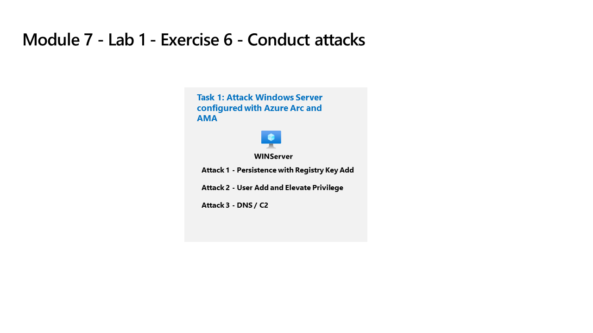

---
lab:
  title: "Exercice\_6 – mener des attaques"
  module: Learning Path 7 - Create detections and perform investigations using Microsoft Sentinel
---

# Parcours d’apprentissage 7 – Labo 1 – Exercice 6 – Mener des attaques

## Scénario de l’exercice



Vous allez simuler les attaques que vous utiliserez ultérieurement pour détecter et investiguer dans Microsoft Sentinel.


>**Remarque :** Une **[simulation de labo interactive](https://mslabs.cloudguides.com/guides/SC-200%20Lab%20Simulation%20-%20Perform%20simulated%20attacks)** est disponible et vous permet de progresser à votre propre rythme. Il peut exister de légères différences entre la simulation interactive et le labo hébergé. Toutefois, les concepts et idées de base présentés sont identiques. 


### Tâche 1 : attaque de persistance avec l’ajout de la clé de Registre

>**Important :** les étapes suivantes sont effectuées sur une machine différente de celle que vous utilisiez précédemment. Recherchez les références de nom de machine virtuelle.

Dans cette tâche, vous allez effectuer des attaques sur l’hôte connecté à Azure Arc avec l’agent Azure Monitor configuré.

1. Connectez-vous à la machine virtuelle WINServer en tant qu’administrateur ou administratrice avec le mot de passe : **Pa55w.rd**.  

    >**Important :** la fonctionnalité *ENREGISTRER* du labo peut entraîner la déconnexion de WINServer à partir d’Azure Arc. Un redémarrage résout le problème.  

1. Sélectionnez **Démarrer** dans Windows. Puis **Marche/Arrêt**, et **Redémarrer**.

1. Suivez les instructions pour vous reconnecter à WINServer.

1. Dans la recherche de la barre des tâches, entrez *Commande*. L’invite de commandes s’affiche dans les résultats de la recherche. Cliquez avec le bouton de droite sur l’invite de commande et sélectionnez **Exécuter en tant qu’administrateur**. Sélectionnez **Oui** dans la fenêtre Contrôle de compte d’utilisateur qui s’affiche pour permettre à l’application de s’exécuter.

1. Dans l’invite de commandes, créez un dossier Temp dans le répertoire racine. N’oubliez pas d’appuyer sur Entrée après la dernière ligne :

    ```CommandPrompt
    cd \
    mkdir temp
    cd temp
    ```

1. Copiez et exécutez cette commande pour simuler la persistance du programme :

    ```CommandPrompt
    REG ADD "HKCU\SOFTWARE\Microsoft\Windows\CurrentVersion\Run" /V "SOC Test" /t REG_SZ /F /D "C:\temp\startup.bat"
    ```


### Tâche 2 : attaque par élévation de privilèges avec ajout d’utilisateurs

1. Copiez et exécutez cette commande pour simuler la création d’un compte Administrateur. N’oubliez pas d’appuyer sur Entrée après la dernière ligne :

    ```CommandPrompt
    net user theusernametoadd /add
    net user theusernametoadd ThePassword1!
    net localgroup administrators theusernametoadd /add
    ```


### Tâche 3 : Attaque de contrôle et commande avec DNS

1. Copiez et exécutez cette commande pour créer un script qui simulera une requête DNS sur un serveur C2 :

    ```CommandPrompt
    notepad c2.ps1
    ```

1. Sélectionnez **Oui** pour créer un fichier et copier le script PowerShell suivant dans *c2.ps1*.

    >**Remarque :** le collage dans le fichier de machine virtuelle peut ne pas afficher la longueur complète du script. Vérifiez que le script correspond aux instructions contenues dans le fichier *c2.ps1*.

    ```PowerShell
    param(
        [string]$Domain = "microsoft.com",
        [string]$Subdomain = "subdomain",
        [string]$Sub2domain = "sub2domain",
        [string]$Sub3domain = "sub3domain",
        [string]$QueryType = "TXT",
        [int]$C2Interval = 8,
        [int]$C2Jitter = 20,
        [int]$RunTime = 240
    )
    $RunStart = Get-Date
    $RunEnd = $RunStart.addminutes($RunTime)
    $x2 = 1
    $x3 = 1 
    Do {
        $TimeNow = Get-Date
        Resolve-DnsName -type $QueryType $Subdomain".$(Get-Random -Minimum 1 -Maximum 999999)."$Domain -QuickTimeout
        if ($x2 -eq 3 )
        {
            Resolve-DnsName -type $QueryType $Sub2domain".$(Get-Random -Minimum 1 -Maximum 999999)."$Domain -QuickTimeout
            $x2 = 1
        }
        else
        {
            $x2 = $x2 + 1
        }    
        if ($x3 -eq 7 )
        {
            Resolve-DnsName -type $QueryType $Sub3domain".$(Get-Random -Minimum 1 -Maximum 999999)."$Domain -QuickTimeout
            $x3 = 1
        }
        else
        {
            $x3 = $x3 + 1
        }
        $Jitter = ((Get-Random -Minimum -$C2Jitter -Maximum $C2Jitter) / 100 + 1) +$C2Interval
        Start-Sleep -Seconds $Jitter
    }
    Until ($TimeNow -ge $RunEnd)
    ```

1. Dans le menu Bloc-notes, sélectionnez **Fichier**, puis **Enregistrer**. 

1. Revenez à la fenêtre d’invite de commandes, tapez la commande suivante et appuyez sur Entrée. 

    >**Remarque :** vous verrez les erreurs de résolution DNS. Ceci est normal.

    ```CommandPrompt
    Start PowerShell.exe -file c2.ps1
    ```

>**Important :** ne fermez pas ces fenêtres. Laissez ce script PowerShell s’exécuter en arrière-plan. La commande doit générer des entrées de journal pendant quelques heures. Vous pouvez passer à la tâche suivante et aux exercices suivants pendant l’exécution de ce script. Les données créées par cette tâche seront utilisées dans le labo Repérage des menaces ultérieurement. Ce processus ne crée pas de quantités substantielles de données ou de traitement.


## Passez à l’exercice 7
