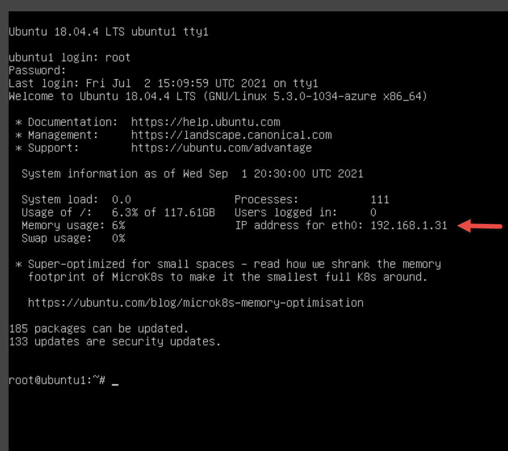

---
lab:
  title: "Exercice\_3\_: connecter des hôtes Linux à Microsoft\_Sentinel avec des connecteurs de données"
  module: Learning Path 8 - Connect logs to Microsoft Sentinel
---

# Parcours d’apprentissage 8 - Labo 1 - Exercice 3 - Connecter des hôtes Linux à Microsoft Sentinel avec des connecteurs de données

## Scénario du labo


Vous êtes un analyste des opérations de sécurité travaillant dans une entreprise ayant mis en œuvre Microsoft Sentinel. Vous devez apprendre à connecter des données de journal provenant de nombreuses sources de données dans votre organisation. La source de données suivante est constituée par des machines virtuelles Linux qui utilisent le CEF (Common Event Format) via les connecteurs Ancien agent et Syslog.

>**Important :** les exercices de laboratoire du parcours d’apprentissage #8 se trouvent dans un *environnement autonome*. Si vous quittez le labo sans enregistrer, vous devrez réexécuter certaines configurations.

### Temps estimé pour terminer ce labo : 30 minutes

>**Important :** il existe des étapes dans les tâches suivantes effectuées dans différentes machines virtuelles. Recherchez les références de nom de machine virtuelle.

### Tâche 1 : Accéder à l’espace de travail Microsoft Sentinel

Dans cette tâche, vous allez accéder à votre espace de travail Microsoft Sentinel.

>**Remarque :** Microsoft Sentinel a été prédéployé dans votre abonnement Azure avec le nom **defenderWorkspace** et les solutions *Content Hub* requises ont été installées.

1. Connectez-vous à la machine virtuelle **WIN1** en tant qu'Admin avec le mot de passe suivant : **Pa55w.rd**.  

1. Ouvrez le navigateur Microsoft Edge.

1. Dans le navigateur Edge, accédez au portail Azure à l’adresse <https://portal.azure.com>.

1. Dans la boîte de dialogue **Connexion**, copiez et collez le compte de **messagerie du locataire** fourni par l’hébergeur du labo, puis sélectionnez **Suivant**.

1. Dans la boîte de dialogue **Entrer le mot de passe**, copiez et collez le **mot de passe du locataire** fourni par l’hébergeur du labo, puis sélectionnez **Connexion**.

1. Dans la barre de recherche du portail Azure, tapez *Sentinel*, puis sélectionnez **Microsoft Sentinel**.

1. Sélectionnez le **defenderWorkspace** Microsoft Sentinel.

### Tâche 2 : connecter un hôte Linux à l’aide du connecteur Common Event Format

Dans cette tâche, vous allez connecter un hôte Linux à Microsoft Sentinel avec le CEF (Common Event Format) via le connecteur Ancien agent.

1. Dans les menus de gauche de Microsoft Sentinel, faites défiler jusqu’à la section *Gestion de contenu*, puis sélectionnez **Hub de contenu**.

1. Dans le *Hub de contenu*, recherchez la solution **Common Event Format** et sélectionnez-la dans la liste.

1. Dans la page de solution *Common Event Format*, sélectionnez **Gérer**.

    >**Remarque :** la solution *Common Event Format* installe les connecteurs *CEF (Common Events Format) via AMA* et *CEF (Common Events Format).*

1. Sélectionnez le connecteur de données *CEF (Common Events Format) via AMA*, puis **Ouvrir la page du connecteur** dans le panneau d’informations du connecteur.

1. Dans la section *Configuration*, sous l’onglet *Instructions*, copiez dans le presse-papiers la commande indiquée dans *1.2 Installer le collecteur CEF sur la machine Linux*.

1. Lancez votre machine virtuelle **LIN1**. Connectez-vous avec le nom d’utilisateur et le mot de passe fournis par l’hébergeur de labo. **Conseil :** vous devrez peut-être appuyer sur la touche Entrée pour afficher l’invite de connexion.

1. Notez l’adresse IP de votre serveur LIN1. Voir la capture d’écran ci-dessous comme exemple :

    

1. Revenez à la machine virtuelle **WIN1**. Lancez Windows PowerShell en tapant **Windows PowerShell** dans le formulaire de recherche dans la barre des tâches, puis sélectionnez **Windows PowerShell**.

1. Entrez la commande PowerShell suivante en spécifiant les informations relatives à votre serveur Linux, puis appuyez sur Entrée :

    ```PowerShell
    ssh insert-your-linux-IP-address-here -l insert-linux-user-name-here
    ```

1. Entrez *oui* pour confirmer la connexion, puis tapez le mot de passe de l’utilisateur et appuyez sur Entrée. Votre écran doit ressembler à ceci :

    

1. Vous pouvez maintenant coller la commande *1.2 Installer le collecteur CEF sur la machine Linux* de l’étape précédente. Assurez-vous que le script d’Azure se trouve dans le presse-papiers. Dans PowerShell, cliquez avec le bouton droit sur la barre supérieure, et sélectionnez **Modifier**, puis **Coller**. 

1. Une fois collé et avant d’appuyer sur Entrée, ajoutez le caractère **3** au mot *python*, comme indiqué ci-dessous :

    


1. Une fois le script modifié, appuyez sur Entrée. Le script s’exécute sur votre serveur Linux à distance. Lorsque le script traite correctement, il doit ressembler à cet écran :

    

1. Tapez **exit** pour fermer la connexion shell à distance sur LIN1.


### Tâche 3 : connecter un hôte Linux à l’aide du connecteur Syslog

Dans cette tâche, vous allez connecter un hôte Linux à Microsoft Sentinel avec le connecteur Syslog.

1. Revenez au navigateur Microsoft Edge contenant votre portail Microsoft Sentinel et fermez la page du connecteur de données « Common Event Format (CEF) via l’ancien agent » en sélectionnant le bouton « x » dans le coin supérieur droit.

1. Dans les menus de gauche de Microsoft Sentinel, faites défiler jusqu’à la section *Gestion de contenu*, puis sélectionnez **Hub de contenu**.

1. Dans le *Hub de contenu*, recherchez la solution **Syslog** et sélectionnez-la dans la liste.

1. Dans la page de la solution *Syslog*, sélectionnez **Gérer**.

    >**Remarque :** la solution *Syslog* installe le connecteur de données *Syslog*, 5 règles analytiques, 9 requêtes de repérage et 1 classeur.

1. Sélectionnez le connecteur de données *Syslog*, puis **Ouvrir la page du connecteur** dans le panneau d’informations du connecteur.

1. Dans la section *Configuration*, développez **Installer l’agent sur une machine Linux non Azure**.

1. Sélectionnez le lien **Télécharger et installer l’agent pour les machines Linux non Azure**.

    >**Remarque :** votre espace de travail Log Analytics doit afficher *2 ordinateurs Windows connectés*. Il s’agit des machines virtuelles WINServer et AZWIN01 connectées précédemment.

1. Sélectionnez ensuite l’onglet **Serveurs Linux**.

    >**Remarque :** votre espace de travail Log Analytics doit afficher *1 ordinateur Linux connecté*. Il s’agit de la machine virtuelle LIN1 (ubuntu1) connectée précédemment au connecteur CEF.

1. Sélectionnez **Instructions de l’agent Log Analytics**.

1. Copiez la commande de la zone *Télécharger et intégrer l’agent pour Linux* dans le Presse-papiers.

1. Lancez votre machine virtuelle LIN2. Connectez-vous avec le nom d’utilisateur et le mot de passe fournis par votre hôte de labo. **Conseil :** vous devrez peut-être appuyer sur la touche Entrée pour afficher l’invite de connexion.

1. Notez l’adresse IP de votre serveur LIN2. Voir la capture d’écran ci-dessous comme exemple :

    

1. Revenez à la machine virtuelle **WIN1**. Sélectionnez la console Windows PowerShell utilisée dans la tâche précédente.

1. Entrez la commande PowerShell suivante en spécifiant les informations relatives à votre serveur Linux, puis appuyez sur Entrée :

    ```PowerShell
    ssh insert-your-linux-IP-address-here -l insert-linux-user-name-here
    ```

1. Entrez *oui* pour confirmer la connexion, puis tapez le mot de passe de l’utilisateur et appuyez sur Entrée. Votre écran doit ressembler à ceci :

    

1. Vous êtes maintenant prêt à coller la commande *Télécharger et intégrer l’agent pour Linux* à partir de l’étape précédente. Assurez-vous que le script se trouve dans le Presse-papiers. Dans PowerShell, cliquez avec le bouton droit sur la barre supérieure et sélectionnez **Modifier**, puis **Coller**.

1. Une fois le script collé, appuyez sur Entrée. Le script s’exécute à distance sur votre serveur Linux. Wait

1. Une fois l’opération terminée, tapez **exit** pour fermer la connexion shell à distance sur LIN2.


### Tâche 4 : configurer les fonctionnalités à collecter et leurs gravités pour le connecteur Syslog

Dans cette tâche, vous allez configurer les fonctionnalités de la collecte Syslog.

1. Revenez au navigateur Edge contenant votre portail Microsoft Sentinel et fermez les pages « Espace de travail Log Analytics » et Connecteur de données « Syslog » en sélectionnant le bouton « x » dans le coin supérieur droit deux fois.

1. Dans le portail Microsoft Sentinel, sous *Configuration*, sélectionnez **Paramètres**, puis l’onglet **Paramètres de l’espace de travail**.

1. Dans la zone *Classique*, sélectionnez **Gestion des agents hérités**.

1. Sélectionnez l’onglet **Syslog**.

1. Sélectionnez le bouton **+ Ajouter une fonctionnalité**.

1.  Dans le menu déroulant pour *Nom de la fonctionnalité*, sélectionnez **auth**.

1. Sélectionnez à nouveau le bouton **+ Ajouter une fonctionnalité**.

1. Dans le menu déroulant pour *Nom de l’installation*, sélectionnez **syslog**.

1. Cliquez sur **Appliquer** pour enregistrer vos modifications.

## Passer à l’Exercice 4
