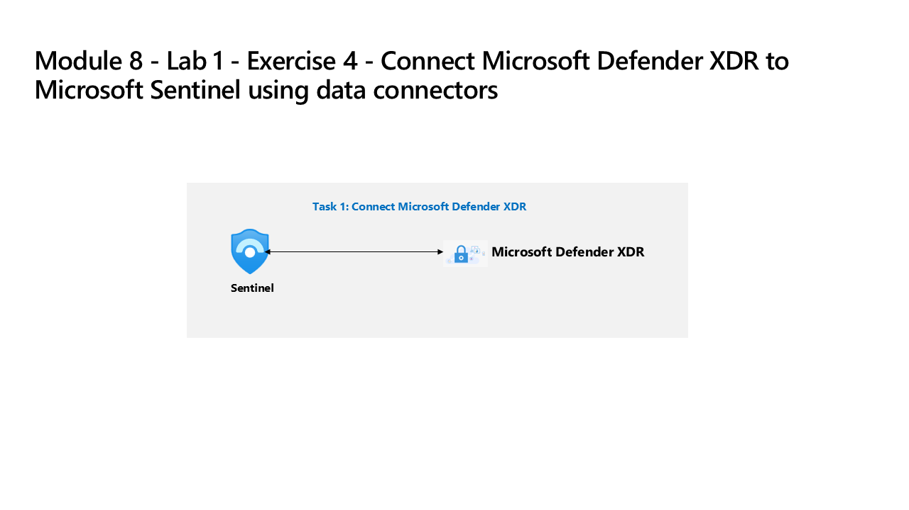

---
lab:
  title: 'Exercice 4 : connecter Defender XDR à Microsoft Sentinel en tirant parti de connecteurs de données'
  module: Learning Path 8 - Connect logs to Microsoft Sentinel
---

# Parcours d’apprentissage 8 – Laboratoire 1 – Exercice 4 – Connecter Defender XDR à Microsoft Sentinel à l’aide des connecteurs de données

## Scénario du labo

Vous êtes Analyste des opérations de sécurité et vous travaillez dans une entreprise qui a déployé Microsoft Defender XDR et Microsoft Sentinel. Vous devez préparer la Plateforme d’opérations de sécurité unifiée qui connecte Microsoft Sentinel à Defender XDR. Votre étape suivante consiste à installer la solution Hub de contenu Defender XDR et à déployer le connecteur de données Defender XDR dans Microsoft Sentinel.

>**Note :** l’environnement de cet exercice est une simulation générée à partir du produit. Comme c’est une simulation limitée, les liens d’une page peuvent ne pas être activés et les entrées texte qui ne sont pas prises en compte dans le script spécifié ne sont pas prises en charge. Un message contextuel indiquant « Cette fonctionnalité n’est pas disponible dans la simulation » s’affiche. Lorsque cela se produit, sélectionnez OK et poursuivez les étapes de l’exercice.

### Tâche 1 : Connecter Defender XDR

Dans cette tâche, vous déployez le connecteur Microsoft Defender XDR.

1. Connectez-vous à la machine virtuelle WIN1 en tant qu’Administrateur avec le mot de passe suivant : **Pa55w.rd**.  

1. Dans le navigateur Microsoft Edge, ouvrez l’environnement simulé en sélectionnant ce lien : <https://app.highlights.guide/start/1c894b46-4b0a-40cb-b0f0-1e1c86c615f3?token=16d48b6c-eace-4a1f-8050-098d29d23a89>

    <!--- [Azure portal]( https://app.highlights.guide/start/1c894b46-4b0a-40cb-b0f0-1e1c86c615f3?token=16d48b6c-eace-4a1f-8050-098d29d23a89). --->

1. Sur la page *Accueil* du portail Azure, sélectionnez l’icône **Microsoft Sentinel**.

1. Sur la page *Microsoft Sentinel*, sélectionnez l’espace de travail **Woodgrove-LogAnalyiticWorkspace**.

1. Dans les menus de gauche de Microsoft Sentinel, faites défiler jusqu’à la section **Gestion de contenu**, puis sélectionnez **Hub de contenu**.

1. Dans le *Hub de contenu*, recherchez la solution **Microsoft Defender XDR**, puis sélectionnez-la dans la liste.

1. Dans la page des détails de la solution *Microsoft Defender XDR*, sélectionnez **Installer**.

1. Une fois l’installation terminée, recherchez la solution **Microsoft Defender XDR**, puis sélectionnez-la.

1. Dans la page des détails de la solution *Microsoft Defender XDR*, sélectionnez **Gérer**

1. Sélectionnez la case à cocher du connecteur de données *Microsoft Defender XDR*, puis sélectionnez la **page Ouvrir le connecteur**.

1. Vous devez voir un message indiquant que la connexion a réussi.

### Tâche 2 : Connectez Microsoft Sentinel à Microsoft Defender XDR

Dans cette tâche, vous poursuivez la simulation et connectez un espace de travail Microsoft Sentinel à Microsoft Defender XDR.

1. Revenez au *Hub de contenu* Microsoft Sentinel (à l’aide du lien de menu « navigation » en haut de la page), puis sélectionnez **Vue d’ensemble (préversion)** dans la section Général du menu de navigation.

1. Sélectionnez le bouton **En savoir plus** dans le message *Centralisez votre SIEM et XDR au même endroit*.

1. En cliquant sur **En savoir plus**, un nouvel onglet s’ouvre dans le navigateur, pointant vers le portail *Microsoft Defender XDR*.

1. Sur la page **Accueil** du portail **Defender Defender**, vous devriez voir une bannière en haut indiquant : *Centralisez votre SIEM et XDR au même endroit*. Sélectionnez le bouton **Connecter un espace de travail**.

1. Sur la page *Choisissez un espace de travail*, sélectionnez l’espace de travail Microsoft Sentinel **woodgrove-loganalyiticsworkspace**.

1. Sélectionnez le bouton **Suivant**.

1. Sur la page **Définir un espace de travail principal**, l’espace de travail Microsoft Sentinel **woodgrove-loganalyiticsworkspace** devrait apparaître dans le menu déroulant. Sélectionnez le bouton **Suivant**.

1. Sur la page *Vérifier et terminer*, vérifiez que l’*Espace de travail* sélectionné est correct et passez en revue les éléments à puces sous la section *À quoi s’attendre lorsque l’espace de travail est connecté*. Cliquez sur le bouton **Connecter**.

1. Vous devriez voir le message *Vous êtes sur le point de connecter un espace de travail*. Cliquez sur le bouton **Connecter**.

1. Vous êtes maintenant sur la page *Espace de travail connecté avec succès*.

1. Cliquez sur le bouton **Fermer**.

1. Sur le portail **Defender XDR**, sur la **page d’accueil**, vous devez voir une bannière en haut avec le message *Votre SIEM et XDR unifié est prêt*. Sélectionnez le bouton **Démarrer la chasse**.

1. Dans *Repérage avancé*, un message devrait s’afficher : « Explorez votre contenu à partir de Microsoft Sentinel ». Dans le menu de navigation *Repérage avancé*, vous trouverez les tables, fonctions et requêtes *Microsoft Sentinel* sous les onglets correspondants.

1. Faites défiler la section **Schéma** jusqu’à l’en-tête **Microsoft Sentinel**, puis double-cliquez sur la table **ThreatIntelligenceIndicator**.

1. Dans le volet *Requête*, une requête (KQL) s'affiche, renvoyant des indicateurs de veille de menaces. Sélectionnez le bouton **Exécuter la requête**.

1. Les résultats devraient apparaître dans le volet *Résultats*.

1. Développez le volet de menu principal de gauche s’il est réduit et développez les nouveaux éléments de menu **Microsoft Sentinel**. Vous devriez voir les options suivantes : *Recherche*, *Gestion des menaces*, *Gestion de contenu* et *Configuration*.

    >**Remarque :** Notez qu’il existe des différences de fonctionnalités entre le portail Microsoft Sentinel d’Azure et Sentinel dans le portail Microsoft Defender XDR **[Différences de fonctionnalités des portails](https://learn.microsoft.com/azure/sentinel/microsoft-sentinel-defender-portal#capability-differences-between-portals)**.

1. Dans le menu **Microsoft Sentinel** de Microsoft Defender XDR, sélectionnez **Configuration**, puis **Connecteurs de données**.

1. Sur la page *Connecteurs de données*, vous devriez voir **Activité Azure** et d’autres connecteurs de données affichés avec l’état **Connecté**.

>**Remarque :** N’hésitez pas à explorer et comparer les autres fonctionnalités de Microsoft Sentinel. Toutefois, comme il s’agit d’une simulation, vos possibilités d’exploration dans le portail Microsoft Defender sont limitées. Dans un environnement réel, vous pourrez explorer toutes les fonctionnalités de Microsoft Sentinel dans le portail Microsoft Defender.

## Vous avez terminé le labo – Veuillez passer au Parcours d’apprentissage 9 – Laboratoire 1 – Exercice 1 – Modifier une règle de sécurité Microsoft.
